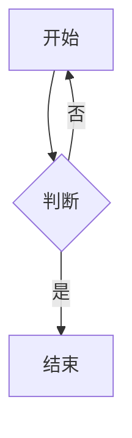

# 公众号复制链路 mermaid/DiagrammeR 支持 —— 实现计划

> **For agentic workers:** REQUIRED SUB-SKILL: Use superpowers:subagent-driven-development (recommended) or superpowers:executing-plans to implement this plan task-by-task. Steps use checkbox (`- [ ]`) syntax for tracking.

**Goal:** 「复制公众号 HTML」时把 mermaid 代码块与 DiagrammeR(grViz) 块本地渲染为 base64 PNG 内嵌正文，VS Code 与 Electron 两端生效。

**Architecture:** 从 `scripts/social_worker.js` 抽取渲染核心到 `lib/diagram/render.js`（签名不变），新增独立子进程脚本 `scripts/render_diagrams.js`，两端在 `buildWechatCopyHtml` 前检测→spawn→替换。Spec：`docs/superpowers/specs/2026-08-26-wechat-diagram-support-design.md`。

**Tech Stack:** Node.js CommonJS、playwright-core（无捆绑浏览器，`findChromium()` 找系统 Chrome/Edge）、cheerio、本地库 `lib/diagram/mermaid.min.js` + `viz.js`。

## Global Constraints

- 项目无测试框架/lint/typecheck——每个任务用 `node --check`（语法）+ `node -e`（行为冒烟）验证，最终靠 Task 6 手动验证。
- **不新增任何 npm 依赖**；只用已有 playwright-core / cheerio / Node 内置。
- spawn 统一用 `spawn(process.execPath, [scriptPath, ...])`（与 `lib/social_worker.js` 现状一致，无需 ELECTRON_RUN_AS_NODE）。
- PNG 样式固定：白底 `#fff` + `padding:12px` + 边框 `1px solid #e0e0e0`（与知乎一致）。
- 任何失败都**降级不中断**：整体失败保留原代码块照常出 HTML；单图失败只丢那一块。
- 代码注释用中文、简洁；字符串单引号为主，遵循现有文件风格。
- 注意：工作区有**知乎 mermaid 支持的未提交改动**（lib/converter.js、lib/quarto.js、lib/zhihu.js、scripts/social_worker.js、未跟踪 lib/diagram/）。提交时**只 stage 本计划涉及的文件**，绝不 `git add -A`。
- `renderDiagrams` 对外返回形状扩展为 `{ html, images, rendered, errors }`（新增两字段向后兼容，worker 只解构前两个）。

---

### Task 1: 共享渲染模块 `lib/diagram/render.js`

**Files:**
- Create: `lib/diagram/render.js`

**Interfaces:**
- Consumes: cheerio、`lib/diagram/mermaid.min.js`、`lib/diagram/viz.js`（已存在于工作区）
- Produces（后续任务依赖的确切签名）:
  - `findChromium()` → `string|null` 可执行文件路径
  - `hasDiagramHtml(html)` → `boolean`
  - `renderDiagrams(page, html, images)` → `Promise<{html, images, rendered, errors}>`
  - `svgToPng(renderPage, svg, name)` → `Promise<{pngPath, dataUri}>`
  - `renderViaScript(rootPath, html)` → `Promise<{html, rendered, errors}>`，失败 reject

- [ ] **Step 1: 写入完整模块**

创建 `lib/diagram/render.js`，内容如下（`renderDiagrams`/`svgToPng` 函数体逐行取自 `scripts/social_worker.js:745-870` 当前工作区版本，仅做三处机械调整：`info` 用本模块自己的实现；`DIAGRAM_DIR` 改为 `__dirname`（模块就住在 lib/diagram/）；返回对象追加 `rendered` 计数与 `errors` 数组）：

```js
'use strict';
/**
 * render.js — mermaid / DiagrammeR(grViz) 图表渲染共享模块
 *
 * 使用方：scripts/social_worker.js（知乎发布）、scripts/render_diagrams.js（公众号复制链路）。
 * 本地库 mermaid.min.js / viz.js 与本模块同目录（lib/diagram/），按需注入渲染页。
 */

const fs = require('fs');
const path = require('path');
const os = require('os');

const DIAGRAM_DIR = __dirname;

/** 子进程 stdout 行协议进度（与 social_worker 一致） */
function info(m) { process.stdout.write('INFO:' + m + '\n'); }

// ─── 查找 Chromium（合并 social_worker / xhs_screenshot 两份实现的并集）──────
function findChromium() {
  const home = os.homedir();

  // 1. Playwright 管理的 Chromium 缓存（python/node playwright 共用）
  const cacheDir = path.join(home, '.cache', 'ms-playwright');
  if (fs.existsSync(cacheDir)) {
    for (const entry of fs.readdirSync(cacheDir).filter(e => e.startsWith('chromium'))) {
      const cands = {
        darwin: path.join(cacheDir, entry, 'chrome-mac', 'Chromium.app', 'Contents', 'MacOS', 'Chromium'),
        linux:  path.join(cacheDir, entry, 'chrome-linux', 'chrome'),
        win32:  path.join(cacheDir, entry, 'chrome-win', 'chrome.exe'),
      };
      const p = cands[process.platform];
      if (p && fs.existsSync(p)) return p;
    }
  }

  // 2. 系统已安装的浏览器
  const system = {
    darwin: [
      '/Applications/Google Chrome.app/Contents/MacOS/Google Chrome',
      '/Applications/Chromium.app/Contents/MacOS/Chromium',
      '/Applications/Microsoft Edge.app/Contents/MacOS/Microsoft Edge',
      '/Applications/Brave Browser.app/Contents/MacOS/Brave Browser',
    ],
    linux: [
      '/usr/bin/google-chrome', '/usr/bin/google-chrome-stable',
      '/usr/bin/chromium-browser', '/usr/bin/chromium',
      '/snap/bin/chromium',
    ],
    win32: [
      'C:\\Program Files\\Google\\Chrome\\Application\\chrome.exe',
      'C:\\Program Files (x86)\\Google\\Chrome\\Application\\chrome.exe',
      'C:\\Program Files (x86)\\Microsoft\\Edge\\Application\\msedge.exe',
    ],
  };
  for (const p of (system[process.platform] || [])) {
    if (fs.existsSync(p)) return p;
  }
  return null;
}

// ─── 快速检测：HTML 是否含图表块（无图零开销直通）────────────────────────────
const DIAGRAM_RE = /language-mermaid|class="[^"]*\bmermaid(-js)?\b[^"]*"|<div[^>]*\bgrViz\b/i;
function hasDiagramHtml(html) {
  return typeof html === 'string' && DIAGRAM_RE.test(html);
}

// ─── SVG → 白底边框 PNG ──────────────────────────────────────────────────────
/** 把一段 SVG 渲染成带白底/边框的 PNG，返回 { pngPath, dataUri } */
async function svgToPng(renderPage, svg, name) {
  await renderPage.evaluate((s) => {
    document.getElementById('m2a-root').innerHTML =
      `<div style="display:inline-block;background:#fff;padding:12px;border:1px solid #e0e0e0;line-height:0">${s}</div>`;
  }, svg);
  const box = await renderPage.evaluate(() => {
    const r = document.querySelector('#m2a-root > div').getBoundingClientRect();
    return { width: Math.ceil(r.width), height: Math.ceil(r.height) };
  });
  await renderPage.setViewportSize({
    width: Math.max(1400, box.width),
    height: Math.max(900, box.height),
  });
  await renderPage.waitForTimeout(100);
  const pngPath = path.join(os.tmpdir(),
    `m2a_diagram_${name}_${Date.now()}_${Math.random().toString(36).slice(2, 8)}.png`);
  await renderPage.locator('#m2a-root > div').screenshot({ path: pngPath });
  const dataUri = 'data:image/png;base64,' + fs.readFileSync(pngPath).toString('base64');
  return { pngPath, dataUri };
}

// ─── 核心：把 html 中所有图表块替换为 base64 PNG  ───────────────────────
/**
 * 返回 { html, images, rendered, errors }：
 *   - html 中每个图表块被替换为 
 *   - images 按出现顺序与 data:image 图片一一对应（图表 → 临时 PNG 路径，原图 → 原本地图片）
 *   - rendered 成功数；errors 各失败信息（单图失败保留原块、不中断）
 */
async function renderDiagrams(page, html, images) {
  const cheerio = require('cheerio');
  const $ = cheerio.load(`<div id="root">${html}</div>`);
  const sel = 'pre.mermaid, pre.mermaid-js, code.language-mermaid, div.grViz';
  if (!$(sel).length) return { html, images: images || [], rendered: 0, errors: [] };

  const pendingImages = (images || []).slice();
  const diagramPngs = new Map();   // dataUri -> pngPath
  const errors = [];
  let renderedCount = 0;
  let renderPage = null;
  let mermaidInjected = false;
  let vizInjected = false;
  let tag = 0;

  try {
    renderPage = await page.context().newPage();
    await renderPage.setViewportSize({ width: 1400, height: 900 });
    await renderPage.setContent(
      '<!DOCTYPE html><html><head><meta charset="utf-8"></head><body><div id="m2a-root"></div></body></html>'
    );

    const handled = new Set();
    for (const el of $(sel).toArray()) {
      const $el = $(el);
      const isCode = $el.is('code.language-mermaid');
      const target = isCode ? $el.closest('pre') : $el;
      if (!target.length || handled.has(target[0])) continue;
      handled.add(target[0]);

      try {
        let svg;
        let kind = 'mermaid';
        if ($el.is('div.grViz')) {
          kind = 'grviz';
          const id = $el.attr('id');
          const $script = $(`script[data-for="${id}"]`).first();
          let diagram = '';
          let engine = 'dot';
          if ($script.length) {
            try {
              const data = JSON.parse($script.text());
              diagram = (data && data.x && data.x.diagram) || '';
              engine = (data && data.x && data.x.config && data.x.config.engine) || 'dot';
            } catch (_) {}
          }
          if (!diagram) throw new Error('grViz 缺少 diagram 数据');
          if (!vizInjected) {
            await renderPage.addScriptTag({ path: path.join(DIAGRAM_DIR, 'viz.js') });
            vizInjected = true;
          }
          svg = await renderPage.evaluate(
            ({ dot, eng }) => window.Viz(dot, { format: 'svg', engine: eng }),
            { dot: diagram, eng: engine }
          );
        } else {
          const code = target.text().trim();
          if (!code) throw new Error('mermaid 代码为空');
          if (!mermaidInjected) {
            await renderPage.addScriptTag({ path: path.join(DIAGRAM_DIR, 'mermaid.min.js') });
            await renderPage.evaluate(() => {
              window.mermaid.initialize({ startOnLoad: false, theme: 'default', securityLevel: 'loose' });
            });
            mermaidInjected = true;
          }
          svg = await renderPage.evaluate(async ({ txt, id }) => {
            const r = await window.mermaid.render(id, txt);
            return r.svg;
          }, { txt: code, id: 'm2a_diagram_' + tag });
        }

        const { pngPath, dataUri } = await svgToPng(renderPage, svg, `${kind}_${tag}`);
        tag++;
        renderedCount++;
        diagramPngs.set(dataUri, pngPath);

        const imgHtml = ``;
        if (kind === 'grviz') {
          const id = $el.attr('id');
          $(`script[data-for="${id}"]`).remove();
          $el.replaceWith(imgHtml);
        } else {
          target.replaceWith(imgHtml);
        }
        info(`图表渲染成功：${kind} #${tag}`);
      } catch (err) {
        errors.push(err.message);
        info(`⚠️ 图表渲染失败，保留原文块：${err.message}`);
      }
    }

    // 按出现顺序把 data:image 图片与本地图片文件一一对应
    const rebuilt = [];
    $('img[src^="data:image"]').each((_, img) => {
      const src = $(img).attr('src');
      if (diagramPngs.has(src)) rebuilt.push(diagramPngs.get(src));
      else if (pendingImages.length) rebuilt.push(pendingImages.shift());
    });
    // 清理残留空容器 + 摘掉内部标记属性
    $('div:empty, figure:empty').remove();
    $('[data-m2a-diagram]').removeAttr('data-m2a-diagram');

    return { html: $('#root').html() || '', images: rebuilt, rendered: renderedCount, errors };
  } finally {
    if (renderPage) await renderPage.close().catch(() => {});
  }
}

// ─── spawn 子进程封装（公众号复制链路两端共用）───────────────────────────────
/**
 * spawn scripts/render_diagrams.js 渲染图表；resolve { html, rendered, errors }，失败 reject。
 * rootPath：VS Code 端传 extContext.extensionUri.fsPath；Electron 端传 appRoot。
 */
function renderViaScript(rootPath, html) {
  return new Promise((resolve, reject) => {
    const scriptPath = path.join(rootPath, 'scripts', 'render_diagrams.js');
    const stamp = Date.now();
    const inFile = path.join(os.tmpdir(), `m2a_wechat_in_${stamp}.json`);
    const outFile = path.join(os.tmpdir(), `m2a_wechat_out_${stamp}.json`);
    try {
      fs.writeFileSync(inFile, JSON.stringify({ html }), 'utf8');
    } catch (e) {
      reject(new Error('写入临时文件失败: ' + e.message));
      return;
    }

    const { spawn } = require('child_process');
    const proc = spawn(process.execPath, [scriptPath, inFile, outFile], { windowsHide: true });
    let errMsg = '';
    proc.stderr.on('data', d => { errMsg += d.toString(); });
    proc.on('error', err => reject(new Error('启动渲染进程失败: ' + err.message)));
    proc.on('close', (code) => {
      try {
        if (!fs.existsSync(outFile)) {
          reject(new Error(`渲染脚本未产出结果(exit ${code})${errMsg ? ': ' + errMsg.trim() : ''}`));
          return;
        }
        resolve(JSON.parse(fs.readFileSync(outFile, 'utf8')));
      } catch (e) {
        reject(new Error('解析渲染结果失败: ' + e.message));
      } finally {
        fs.unlink(inFile, () => {});
        fs.unlink(outFile, () => {});
      }
    });
  });
}

module.exports = { findChromium, hasDiagramHtml, renderDiagrams, svgToPng, renderViaScript };
```

- [ ] **Step 2: 语法与行为冒烟（无需浏览器）**

```powershell
node --check lib/diagram/render.js
node -e "const m=require('./lib/diagram/render'); console.log(typeof m.findChromium, typeof m.hasDiagramHtml, typeof m.renderDiagrams, typeof m.svgToPng, typeof m.renderViaScript); console.log(m.findChromium()); console.log(m.hasDiagramHtml('<pre><code class=\"language-mermaid\">x</code></pre>'), m.hasDiagramHtml('<p>普通</p>'));"
```

预期输出依次为：五个 `function`；一个存在的 chrome.exe 路径（本机 `C:\Program Files\Google\Chrome\Application\chrome.exe`）；`true false`。

- [ ] **Step 3: Commit**

```bash
git add lib/diagram/render.js
git commit -m "refactor: extract diagram render core into lib/diagram/render.js"
```

---

### Task 2: `scripts/social_worker.js` 切换到共享模块

**Files:**
- Modify: `scripts/social_worker.js`（删除三段内联函数，改为 require）

**Interfaces:**
- Consumes: Task 1 的 `{ findChromium, renderDiagrams }`
- Produces: 对外契约不变——`module.exports.renderDiagrams` 仍可被外部拿到（现为转发引用）；知乎链路行为不变

- [ ] **Step 1: 顶部加 require**

在 `scripts/social_worker.js` 第 24 行（`const os = require('os');`）之后加：

```js
const { findChromium, renderDiagrams } = require('../lib/diagram/render');
```

- [ ] **Step 2: 删除内联 `findChromium`**

整段删除 `scripts/social_worker.js:36-62`（从 `// ─── 查找 Chromium ───...` 注释行到该函数结束的 `}`）。其余代码对 `findChromium()` 的调用点（getBrowser 内，约 133 行）自动落到 require 进来的版本。

- [ ] **Step 3: 删除内联 `renderDiagrams` 与 `svgToPng`**

整段删除当前工作区版本的 `scripts/social_worker.js:745-870`（含其上方的 JSDoc 注释块，即从 `* 返回 { html, images }：` 所在注释开始，到 `svgToPng` 函数结束的 `}` 为止；注意保留其后的 `focusEditorEnd` 函数）。函数体已原样搬入 lib/diagram/render.js。

- [ ] **Step 4: 保持对外导出兼容**

文件末尾 `module.exports`（约 1114-1122 行）不动——其中的 `renderDiagrams` 名字现在解析到顶部 require 的绑定，外部拿到的仍是同一函数。

- [ ] **Step 5: 验证**

```powershell
node --check scripts/social_worker.js
node -e "const w=require('./scripts/social_worker'); const r=require('./lib/diagram/render'); if(w.renderDiagrams!==r.renderDiagrams){console.error('MISMATCH');process.exit(1)} console.log('OK exports forwarded')"
```

预期输出：`OK exports forwarded`（第二句不会触发入口执行，因入口包在 `require.main === module` 里）。

- [ ] **Step 6: Commit**

```bash
git add scripts/social_worker.js
git commit -m "refactor: social_worker uses shared lib/diagram/render"
```

---

### Task 3: 渲染子进程脚本 `scripts/render_diagrams.js` + fixture 端到端验证

**Files:**
- Create: `scripts/render_diagrams.js`
- Create（临时，验证后删）: `%TEMP%\m2a_plan_in.json`、`%TEMP%\m2a_plan_out.json`

**Interfaces:**
- Consumes: Task 1 的 `hasDiagramHtml` / `renderDiagrams` / `findChromium`
- Produces: CLI 约定 `node render_diagrams.js <input.json> <output.json>`；output 形状 `{ html, rendered, errors }`——Task 4/5 的 `renderViaScript` 依赖此约定

- [ ] **Step 1: 写入脚本**

创建 `scripts/render_diagrams.js`：

```js
#!/usr/bin/env node
'use strict';
/**
 * render_diagrams.js — 公众号复制链路的图表渲染子进程
 *
 * 用法：node render_diagrams.js <input.json> <output.json>
 *   input : { "html": "<div>...</div>" }
 *   output: { "html": "...", "rendered": N, "errors": ["..."] }
 *
 * 流程：findChromium() → headless 启动 → lib/diagram/render.renderDiagrams() → 写 output。
 * 致命错误走 stderr ERROR: 行协议 + 非 0 退出码；单个图表失败由 renderDiagrams 内部容错。
 */

const fs = require('fs');
const { hasDiagramHtml, renderDiagrams, findChromium } = require('../lib/diagram/render');

async function main() {
  const [inFile, outFile] = process.argv.slice(2);
  if (!inFile || !outFile) {
    process.stderr.write('Usage: node render_diagrams.js <input.json> <output.json>\n');
    process.exit(1);
  }

  const input = JSON.parse(fs.readFileSync(inFile, 'utf8'));
  const html = String(input.html || '');
  if (!hasDiagramHtml(html)) {
    fs.writeFileSync(outFile, JSON.stringify({ html, rendered: 0, errors: [] }), 'utf8');
    return;
  }

  const executablePath = findChromium();
  if (!executablePath) {
    process.stderr.write('ERROR:未找到可用的 Chrome/Chromium/Edge，无法渲染流程图\n');
    process.exit(2);
  }

  const { chromium } = require('playwright-core');
  const browser = await chromium.launch({
    headless: true,
    executablePath,
    args: ['--no-sandbox', '--disable-dev-shm-usage'],
  });
  try {
    const page = await browser.newPage();
    const result = await renderDiagrams(page, html, []);
    fs.writeFileSync(outFile, JSON.stringify(result), 'utf8');
    console.log('INFO:done rendered=' + result.rendered);
  } finally {
    await browser.close().catch(() => {});
  }
}

main().catch(err => {
  process.stderr.write('ERROR:' + (err && err.message ? err.message : String(err)) + '\n');
  process.exit(1);
});
```

- [ ] **Step 2: 构造 fixture（mermaid 单图）**

```powershell
Set-Content -LiteralPath "$env:TEMP\m2a_plan_in.json" -Value '{"html":"<h2>flow</h2><pre><code class=\"language-mermaid\">graph TD;\n  A[Start] --> B{Q};\n  B -- yes --> C[End];</code></pre><p>tail</p>"}' -Encoding UTF8
```

- [ ] **Step 3: 运行端到端验证**

```powershell
node --check scripts/render_diagrams.js
node scripts/render_diagrams.js "$env:TEMP\m2a_plan_in.json" "$env:TEMP\m2a_plan_out.json"
Get-Content "$env:TEMP\m2a_plan_out.json" -Raw
```

预期：第二条命令 stdout 出现 `INFO:done rendered=1`（及 `INFO:图表渲染成功：mermaid #1`）；第三条输出的 JSON 满足 `"rendered":1`、`"errors":[]`、`html` 含 `data:image/png;base64,` 且不再含 `language-mermaid`、尾部仍有 `<p>tail</p>`。

- [ ] **Step 4: 失败路径冒烟（语法错误的 mermaid 只丢一块）**

```powershell
Set-Content -LiteralPath "$env:TEMP\m2a_plan_bad.json" -Value '{"html":"<pre><code class=\"language-mermaid\">this is not valid mermaid (((</code></pre>"}' -Encoding UTF8
node scripts/render_diagrams.js "$env:TEMP\m2a_plan_bad.json" "$env:TEMP\m2a_plan_out.json"; Write-Output "exit=$LASTEXITCODE"
Get-Content "$env:TEMP\m2a_plan_out.json" -Raw
```

预期：`exit=0`（不致命）；JSON 中 `"errors"` 数组非空、`html` 里原样保留代码块文本。（若该输入恰好被 mermaid 容错渲染成功也算通过——以实际输出为准记录即可。）

- [ ] **Step 5: 清理临时文件并 Commit**

```powershell
Remove-Item "$env:TEMP\m2a_plan_in.json","$env:TEMP\m2a_plan_bad.json","$env:TEMP\m2a_plan_out.json" -ErrorAction SilentlyContinue
git add scripts/render_diagrams.js
git commit -m "feat: standalone diagram render subprocess for wechat copy path"
```

---

### Task 4: VS Code 端接入 `extension.js`

**Files:**
- Modify: `extension.js`（顶部 require 区 + `case 'getWechatHtml'`，现 335-351 行）

**Interfaces:**
- Consumes: Task 1 的 `hasDiagramHtml(html)`、`renderViaScript(rootPath, html)`；现有 `extContext` 模块变量（extension.js:25/47）
- Produces: 无新导出；`case 'getWechatHtml'` 在有图文档时先渲染再构建复制 HTML

- [ ] **Step 1: 顶部加 require**

在 `extension.js:7` 的 converter require 之后加一行：

```js
const { hasDiagramHtml, renderViaScript } = require('./lib/diagram/render');
```

- [ ] **Step 2: 改写 `case 'getWechatHtml'`**

将现 335-351 行整段替换为：

```js
    case 'getWechatHtml': {
      try {
        const workspaceFolder = vscode.workspace.getWorkspaceFolder(vscode.Uri.file(mdPath));
        const workspacePath = workspaceFolder ? workspaceFolder.uri.fsPath : path.dirname(mdPath);
        const cfg = vscode.workspace.getConfiguration('qmd2any');
        const templateName = cfg.get('template', 'wechat');
        const templatePath = getTemplatePath(workspacePath, templateName);
        const { bodyHtml } = renderForPlatform(mdPath);
        const theme = getTheme(currentThemeId);

        // 图表（mermaid/grViz）：先经子进程渲染成 base64 图片，失败降级保留代码块
        let finalBody = bodyHtml;
        if (hasDiagramHtml(bodyHtml)) {
          try {
            const result = await vscode.window.withProgress(
              { location: vscode.ProgressLocation.Notification, title: 'qmd2any: 正在渲染流程图为图片…' },
              () => renderViaScript(extContext.extensionUri.fsPath, bodyHtml)
            );
            finalBody = result.html;
            if (result.errors && result.errors.length) {
              vscode.window.showWarningMessage(`有 ${result.errors.length} 个流程图渲染失败，已保留源码块`);
            }
          } catch (err) {
            log(`流程图渲染降级为代码块: ${err.message}`);
            vscode.window.showWarningMessage(`流程图渲染失败（${err.message}），已保留源码块`);
          }
        }

        const html = buildWechatCopyHtml(finalBody, templatePath, theme);
        panel.webview.postMessage({ type: 'wechatHtml', html });
      } catch (err) {
        log(`buildWechatCopyHtml 失败: ${err.message}`);
        panel.webview.postMessage({ type: 'wechatHtmlError', message: err.message });
      }
      break;
    }
```

（`handleWebviewMessage` 已是 `async function`，extension.js:274，直接 await 合法。）

- [ ] **Step 3: 验证语法**

```powershell
node --check extension.js
```

预期：静默退出（exit 0）。

- [ ] **Step 4: Commit**

```bash
git add extension.js
git commit -m "feat(vscode): render diagrams to images in wechat copy html"
```

---

### Task 5: Electron 端接入 `electron/main.js`

**Files:**
- Modify: `electron/main.js`（顶部 require 区 + `ipcMain.on('getWechatHtml')`，现 399-414 行）

**Interfaces:**
- Consumes: Task 1 同款 `hasDiagramHtml` / `renderViaScript`；Electron 主进程既有变量 `appRoot`（electron/main.js:553 已在用）
- Produces: 无新导出；进度提示按 spec「Electron 端从简」仅打主进程日志，不加 preload 通道

- [ ] **Step 1: 顶部加 require**

在 `electron/main.js:12` 的 converter require 之后加一行：

```js
const { hasDiagramHtml, renderViaScript } = require('../lib/diagram/render');
```

- [ ] **Step 2: 改写 handler**

将现 399-414 行整段替换为：

```js
ipcMain.on('getWechatHtml', async () => {
  try {
    const mdPath = currentFilePath;
    if (!mdPath) {
      sendToRenderer('wechatHtmlError', { message: '请先打开或保存文件' });
      return;
    }
    const { bodyHtml } = renderForPlatform(mdPath);
    const templatePath = getTemplatePath();
    const theme = getTheme(currentThemeId);

    // 图表（mermaid/grViz）：先经子进程渲染成 base64 图片，失败降级保留代码块
    let finalBody = bodyHtml;
    if (hasDiagramHtml(bodyHtml)) {
      console.log('[qmd2any] rendering diagrams for wechat copy...');
      try {
        const result = await renderViaScript(appRoot, bodyHtml);
        finalBody = result.html;
        if (result.errors && result.errors.length) {
          console.log('[qmd2any] diagram render errors:', result.errors.join('; '));
        }
      } catch (err) {
        console.log('[qmd2any] diagram render fallback:', err.message);
      }
    }

    const html = buildWechatCopyHtml(finalBody, templatePath, theme);
    sendToRenderer('wechatHtml', { html });
  } catch (err) {
    sendToRenderer('wechatHtmlError', { message: err.message });
  }
});
```

- [ ] **Step 3: 验证语法**

```powershell
node --check electron/main.js
```

预期：静默退出（exit 0）。

- [ ] **Step 4: Commit**

```bash
git add electron/main.js
git commit -m "feat(electron): render diagrams to images in wechat copy html"
```

---

### Task 6: 打包检查 + 手动验证（功能 / 降级 / 知乎回归）

**Files:**
- 无代码改动；产物检查 + 手动测试

**Interfaces:**
- Consumes: Task 1-5 全部成果
- Produces: 验证通过的结论（或缺陷回修）

- [ ] **Step 1: 打包并检查 vsix 内容**

```powershell
npm run package
npx vsce ls | Select-String -Pattern 'diagram|render_diagrams'
```

预期：列表包含 `lib/diagram/render.js`、`lib/diagram/mermaid.min.js`、`lib/diagram/viz.js`、`scripts/render_diagrams.js`（`.vscodeignore` 未排除 lib/scripts，应自动打入；若缺项需补 `.vscodeignore` 排除规则的反向确认后再打包一次）。

- [ ] **Step 2: 功能验证（F5 调试）**

构造测试文件 `test-diagram.qmd`（放在任意工作区）：

````markdown
---
title: 图表测试
---

## mermaid



## DiagrammeR

```{r}
#| label: gv
DiagrammeR::grViz("digraph{A -> B; B -> C}")
```
````

F5 启动调试宿主 → 打开该文件 → 点「复制公众号」按钮 → 将剪贴板粘贴到本地新建 `.html` 或直接粘进 Word/公众号编辑器草稿：

- 通过标准：出现两张白底浅灰边框图片（顺序：mermaid 在前、grViz 在后），无图文错位；粘贴到公众号编辑器后台图片正常上传显示。
- 过程中出现 Notification「正在渲染流程图为图片…」，完成后消失。

- [ ] **Step 3: 降级验证**

临时把系统 Chrome/Edge 改名不可行的话，改用环境变量法：在调试宿主 launch 前无法轻易屏蔽路径——替代做法是把 `test-diagram.qmd` 里 mermaid 内容改成非法语法 `not valid (((` 后重新复制：通过标准 = 弹出警告「有 N 个流程图渲染失败…」，剪贴板里该处保留源码块、其余内容不受影响。

- [ ] **Step 4: 知乎回归（重构后必测）**

同一 `test-diagram.qmd` 走「发布知乎」全流程（登录态已有则直接发布）：通过标准 = 两张图片按序出现在正文中、发布成功、无图文错位（对应 spec §7.4）。

- [ ] **Step 5: 收尾**

删除临时 `test-diagram.qmd`；若全部通过且无遗留改动，向用户汇报验证结果。

---

## Self-Review 结论（已核对）

1. **Spec 覆盖**：spec §4.1→Task 1；§4.2→Task 2；§4.3→Task 3；§4.4→Task 4；§4.5→Task 5；§4.6→Task 1(renderViaScript)；§5 降级→Task 3 Step 4 + Task 6 Step 3；§7 验证→Task 6；§8 打包风险→Task 6 Step 1。无缺口。
2. **占位符扫描**：无 TBD/TODO；所有代码步骤给出完整代码与确切命令。
3. **类型一致性**：`renderDiagrams` 返回形状 `{html, images, rendered, errors}` 全文一致；`renderViaScript(rootPath, html)` 签名在 Task 1 定义、Task 4/5 调用一致；CLI 约定 `input.json/output.json` 在 Task 1 封装与 Task 3 脚本间一致。
